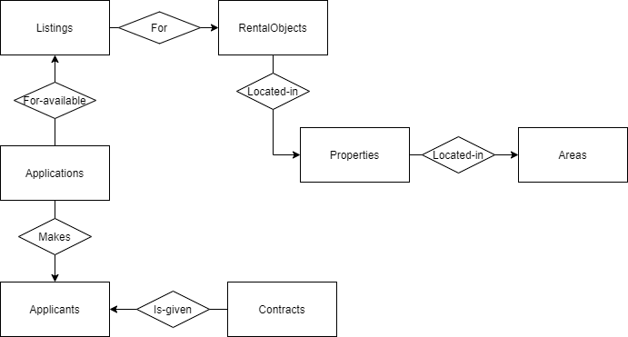

# Simple housing queue system (bostadskö)
## Goal
The goal here is to develop a simple housing queue system. The end-users would be anyone
trying to find an apartment in the city where the housing service is operating.

## Key concepts (entities)
### Rental object
The object that can be rented (can either be an apartment or a parking spot).
### Property
The property the rental object is located in or at.
### Area
The area the property is located in.
### Listing
Whenever a rental object is free, there is a listing which contains information about the apartment, the day the listing was puiblished and when the application time expires. 
### Application
Users can apply for rental objects (or more specifically the listing). Applications store a reference to the listing and applicant and most importantly, the
applicant’s number of waiting days (this will effectively be the waiting list). 
### Contract
The applicant with the
longest waiting time is awarded a contract, with a start and end date. An applicant can only have one active contract.

## Roles
### Applicants
Applicants should be able to:
* Register in the housing queue
* View apartment listings
* Apply for apartments
* ...plus more (for a future date)

### Admins
Admins should be able to:
* Add new apartments (to existing properties, located in existing areas)
* Give contracts to the applicant (automatically selected, with the longest waiting time)
* List all active contracts
* ...plus more (for a future date, such as possibility to add new properties to existing areas, add new areas, terminating contracts i.e. evicting tenants, invoice management)

## Implementation details
 Built with ASP .NET Core 5.0 (MVC), Identity, Entity Framework and Microsoft SQL Server Web (64-bit) 15.0.4003.23.

Preliminarily, the following tables and columns will be used:

### Schemas
* RentalObjects(RentalObjectID [PKEY], PropertyID [FKEY], FloorPlanUrl, Rent, Size, Rooms, Floor, ParkingSpotNumber)

* Properties(PropertyID [PKEY], AreaID [FKEY], StreetAddress, Description)

* Areas(AreaID [PKEY], AreaDescription)

* Listings(ListingID [PKEY], RentalObjectID [FKEY], PublishDate, LastApplicationDate, MoveInDate)

* Applicants(UserID [PKEY], FirstName, LastName, Email, Phone, RegistrationDate, StreetAddress)

* Applications(ApplicationID [PKEY], UserID [FKEY], ListingID [FKEY], ApplicationDate)

* Contracts(ContractID [PKEY], UserID [FKEY], RentalObjectID [FKEY], StartDate, EndDate)

### E/R diagram


### SQL diagram


### To do list
#### Implementation
* ~~Connect to SQL server using ASP.NET Core Secret Manager tool and SqlConnectionStringBuilder class~~
* ~~Add authentication/authorization/Identity~~
* ~~Add custom user data such as registration date to Identity model (https://docs.microsoft.com/en-us/aspnet/core/security/authentication/customize-identity-model?view=aspnetcore-5.0)~~
* ~~Scaffold Identity (Register/Login) according to https://docs.microsoft.com/en-us/aspnet/core/security/authentication/scaffold-identity?view=aspnetcore-5.0&tabs=netcore-cli#scaffold-identity-into-an-mvc-project-with-authorization~~
* ~~Add all entities and migrate them~~
* Add bundling/minification?
* Add Rent, Url, Address, Description, ApartmentSize types

#### Requirements
* ~~Applicant: Register in the housing queue~~ 
* ~~Applicant: Display available listings~~
* Applicant: Apply for apartments
* Admin: Award contracts to the applicant with the longest waiting time
* Admin: List all active contracts

### SQL queries
Raw SQL queries will be used instead of LINQ (required by the assignment), either with FromSqlRaw() and ExecuteSqlRaw() methods but more likely with Keyless Entity Types (https://docs.microsoft.com/en-us/ef/core/modeling/keyless-entity-types?tabs=data-annotations):

```
var blogs = context.Blogs
    .FromSqlRaw("SELECT * FROM dbo.Blogs")
    .ToList();
```
#### Admins
##### What rental objects have no active contracts?
```
SELECT * FROM RentalObjects
WHERE RentalObjectID NOT IN 
	(SELECT RentalObjectID FROM Contracts WHERE EndDate IS NULL OR EndDate > GETDATE());
```

#### Who has the longest waiting time for a listing (first order by longest queue time, then who applied first)?
```
SELECT UserId, FirstName, LastName, RegistrationDate, ApplicationDate, DATEDIFF(DAY, RegistrationDate, GETDATE()) AS QueueTime
FROM Applications AS A
INNER JOIN AspNetUsers AS U
	ON A.UserId=U.Id
WHERE ListingID = ''
ORDER BY QueueTime DESC, ApplicationDate ASC
```

#### List all active contracts and name of owner
```
SELECT U.FirstName, U.LastName, RO.RentalObjectID, C.StartDate, C.EndDate 
FROM Contracts as C
INNER JOIN AspNetUsers AS U
	ON C.UserId=U.Id
INNER JOIN RentalObjects as RO
	ON C.RentalObjectID=RO.RentalObjectID
WHERE EndDate IS NULL OR EndDate > GETDATE();
```

#### For all applicants (users)
##### ✓ Displaying all listings (still open for application), created as a view...
```
CREATE VIEW View_AllOpenListings AS
    SELECT A.Name, RO.Rooms, RO.Size, RO.Rent, P.StreetAddress, P.PropertyPhotoUrl, L.ListingID, L.PublishDate, L.LastApplicationDate, L.MoveInDate
    FROM Listings AS L
    INNER JOIN RentalObjects as RO
        ON RO.RentalObjectID=L.RentalObjectID
    INNER JOIN Properties AS P 
        ON P.PropertyID=RO.PropertyID
    INNER JOIN Areas AS A
        ON P.AreaID=A.AreaID
    WHERE L.LastApplicationDate > GETDATE()
```

##### ✓ Display specific listing (details)
```
SELECT ListingID, L.RentalObjectID, Rent, RentalObjectType, 
        Floor, FloorPlanUrl, Rooms, Size, StreetAddress, 
        P.Description AS PropertyDescription, PropertyPhotoUrl, 
        A.Description AS AreaDescription, Name, PublishDate, 
        LastApplicationDate, MoveInDate 
        FROM Listings AS L
        INNER JOIN RentalObjects as RO
            ON RO.RentalObjectID=L.RentalObjectID
        INNER JOIN Properties AS P 
            ON P.PropertyID=RO.PropertyID
        INNER JOIN Areas AS A
            ON P.AreaID=A.AreaID
            WHERE L.ListingID = ''
```

##### How many rental objects are there in each area?
```
SELECT A.Name AS AreaName, COUNT(RentalObjectID) AS NumberOfRentalObjectsInArea
FROM RentalObjects AS RO
INNER JOIN Properties AS P 
	ON RO.PropertyID=P.PropertyID
INNER JOIN Areas AS A
	ON P.AreaID=A.AreaID
GROUP BY A.Name;
```

##### How many (open) listings are there in each area?
```
SELECT A.Name AS AreaName, COUNT(ListingID) AS NumberOfListingsInArea
FROM Listings AS L
INNER JOIN RentalObjects AS RO
	ON L.RentalObjectID=RO.RentalObjectID
INNER JOIN Properties AS P 
	ON RO.PropertyID=P.PropertyID
INNER JOIN Areas AS A
	ON P.AreaID=A.AreaID
WHERE LastApplicationDate > GETDATE()
GROUP BY A.Name;
```

#### For individual applicants (users)
##### Make an application
Check if already made application for listing:
```
SELECT * FROM Applications WHERE ListingID = '' AND UserID = ''
```
Then add it:
```
INSERT INTO Applications (ApplicationID, UserID, ListingID, ApplicationDate) 
    VALUES ({0}, {1}, {2}, {2})", applicationID, userID, listingID, applicationDate)
```

##### See all applications (previous and current)
```
SELECT RO.RentalObjectID, RO.Rooms, RO.Size, RO.Rent, P.StreetAddress, ApplicationDate, LastApplicationDate, L.MoveInDate
FROM Applications AS A
INNER JOIN AspNetUsers AS U
	ON A.UserId=U.Id
INNER JOIN Listings as L
	ON A.ListingID = L.ListingID
INNER JOIN RentalObjects as RO
	ON L.RentalObjectID = RO.RentalObjectID
INNER JOIN Properties as P
	ON RO.PropertyID = P.PropertyID
WHERE UserId = ''
```

### .NET commandline
#### Migrations
EF Core migrations:

`dotnet ef migrations add InitialCreate`  
`dotnet ef database update`

#### Identity roles
Instead of creating a RoleController or something similar, an "Admin" role was simply manually added like so:

`
var role = new IdentityRole();
            role.Name = "Admin";
            await _roleManager.CreateAsync(role);
`

#### dotnet template
MVC template with Individual User Accounts was used:

`dotnet new mvc -au Individual`