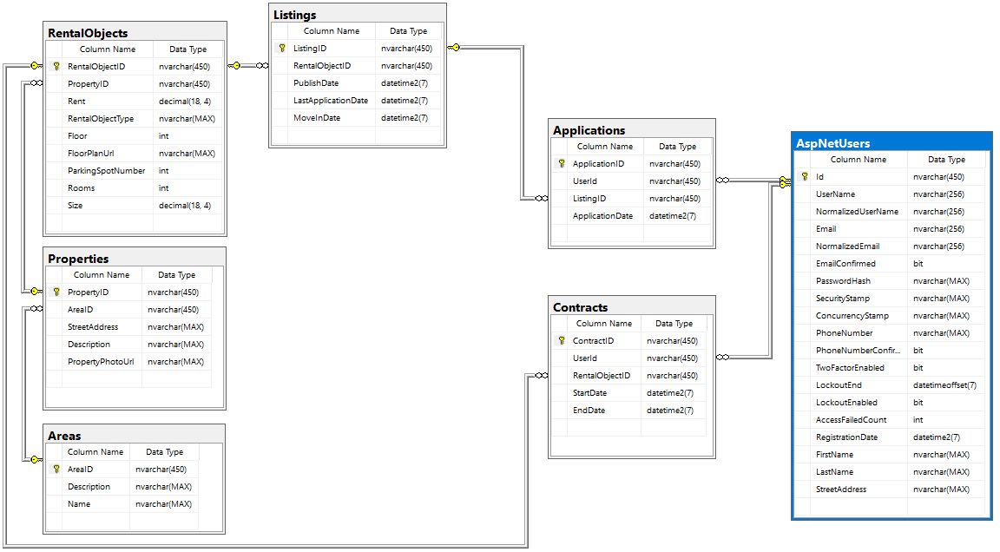

# Simple housing queue system (bostadskö)
## Technical details
 Built with ASP .NET Core 5.0 (MVC), Identity, Entity Framework and Microsoft SQL Server Web (64-bit) 15.0.4003.23.

## Goal
The idea here is to develop a simple housing queue system. The end-users would be anyone
trying to find an apartment in the city where the housing service is operating.

## Key concepts (entities)
### Rental object
The object (apartment) that can be rented.
### Property
The property the apartment is located in.
### Area
The area the property is located in.
### Listing
Whenever an apartment is free, there is a listing which contains information about the apartment, the day the listing was puiblished and when the application time expires. 
### Application
Users can apply for apartments (or more specifically the listing). Applications contains information about the listing, the applicant and the
applicant’s number of waiting days (this will effectively be the waiting list). 
### Contract
The applicant with the
longest waiting time is awarded a contract, with a start and end date. An applicant can only have one active contract.

## Roles
### Users (Applicants) 
Users should be able to:
* Register in the housing queue
* View apartment listings
* Apply for apartments
* ...plus more (for a future date)

### Admins
Admins should be able to:
* Add new apartments (to existing properties, located in existing areas)
* Give contracts to the applicant (automatically selected, with the longest waiting time)
* List all active contracts
* ...plus more (for a future date, such as possibility to add new properties to existing areas, add new areas, terminating contracts i.e. evicting tenants, invoice management)

## Data
Microsoft SQL Server Web (64-bit) 15.0.4003.23 will be used as DBMS.

Preliminarily, the following tables and columns will be used:

### Schemas
* RentalObjects(RentalObjectID [PKEY], PropertyID [FKEY], FloorPlanUrl, Rent)

* Properties(PropertyID [PKEY], AreaID [FKEY], StreetAddress, Description)

* Areas(AreaID [PKEY], AreaDescription)

* Listings(ListingID [PKEY], RentalObjectID [FKEY], PublishDate, LastApplicationDate)

* Users(UserID [PKEY], FirstName, LastName, Email, Phone, RegistrationDate)

* Applications(ApplicationID [PKEY], UserID [FKEY], ListingID [FKEY], QueueTime, ApplicationDate)

* Contracts(ContractID [PKEY], UserID [FKEY], RentalObjectID [FKEY], StartDate, EndDate)

### EF diagram


### SQL diagram


## Development details
### To do list
#### Implementation
* ~~Connect to SQL server using ASP.NET Core Secret Manager tool and SqlConnectionStringBuilder class~~
* ~~Add authentication/authorization/Identity~~
* ~~Scaffold Identity (Register/Login) according to https://docs.microsoft.com/en-us/aspnet/core/security/authentication/scaffold-identity?view=aspnetcore-5.0&tabs=netcore-cli#scaffold-identity-into-an-mvc-project-with-authorization~~
* ~~Add all entities and migrate them~~
* Add bundling/minification?

#### Requirements
* ~~Applicant: Register in the housing queue~~ 
* ~~Applicant: Display available listings~~
* Applicant: Apply for apartments
* Admin: Add new apartments to existing properties
* Admin: Award contracts to the applicant with the longest waiting time
* Admin: List all active contracts

### Raw SQL queries
Raw SQL queries will be used instead of LINQ (assignment rules):

```
var blogs = context.Blogs
    .FromSqlRaw("SELECT * FROM dbo.Blogs")
    .ToList();
```
### Migrations
EF Core migrations:

`dotnet ef migrations add InitialCreate`  
`dotnet ef database update`

### Identity roles
Instead of creating a RoleController or something similar, an "Admin" role was simply manually added like so:

`
var role = new IdentityRole();
            role.Name = "Admin";
            await _roleManager.CreateAsync(role);
`

### dotnet template
MVC template with Individual User Accounts was used:

`dotnet new mvc -au Individual`